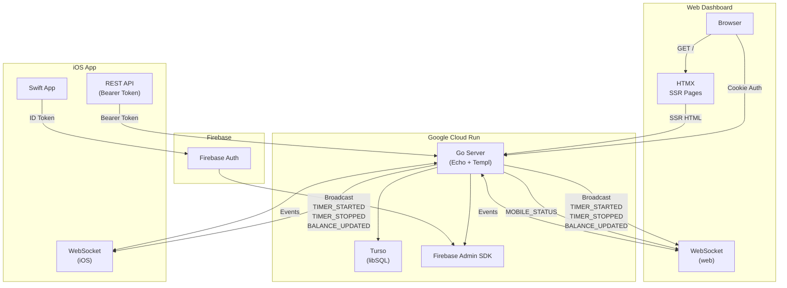
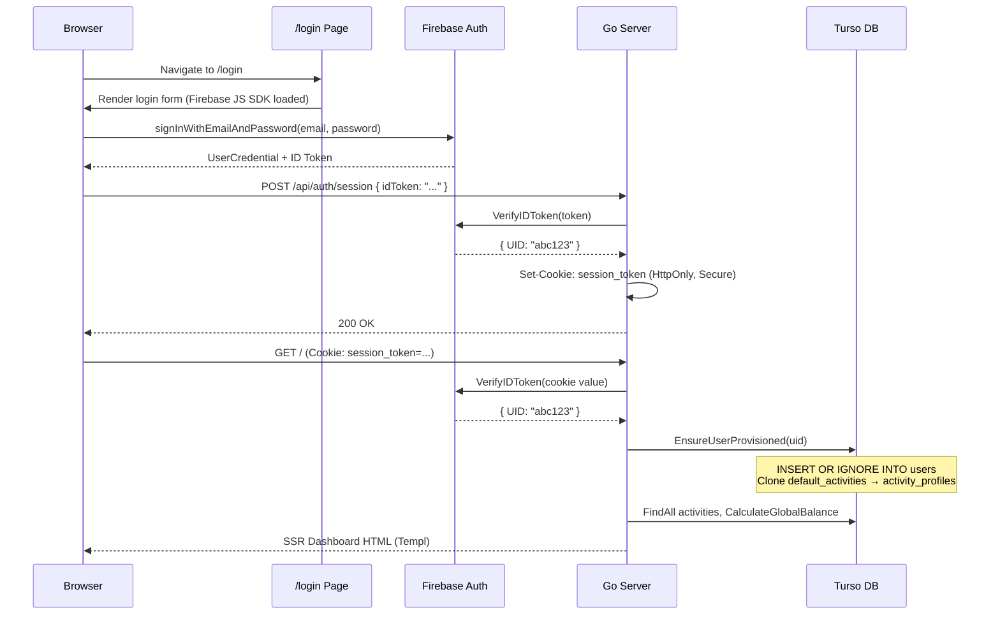

# Balance Web — Go Backend & HTMX Dashboard

> A real-time, multi-tenant time-tracking platform built with Go, HTMX, and WebSockets.  
> The server acts as the **single source of truth** for both the HTMX web dashboard and the companion Swift iOS app.

## Demo


---

## Tech Stack

| Layer | Technology |
|-------|-----------|
| **Language** | Go 1.23 |
| **Web Framework** | [Echo v4](https://echo.labstack.com/) |
| **Templating** | [Templ](https://templ.guide/) — type-safe Go HTML components |
| **Frontend Interactivity** | [HTMX](https://htmx.org/) + Vanilla TypeScript |
| **Styling** | [Tailwind CSS](https://tailwindcss.com/) (CLI build, dark mode) |
| **Real-Time** | WebSockets via [gorilla/websocket](https://github.com/gorilla/websocket) |
| **Database** | [Turso](https://turso.tech/) (libSQL / distributed SQLite) |
| **Authentication** | [Firebase Admin SDK](https://firebase.google.com/docs/admin/setup) (Go) + Firebase JS SDK (client) |
| **Deployment** | Google Cloud Run, Artifact Registry, GitHub Actions CI/CD |
| **Asset Bundling** | [esbuild](https://esbuild.github.io/) (TypeScript → JS) |

---

## High-Level Architecture & Design Choices

### Project Structure

```
balance-web/
├── cmd/server/main.go              # Entry point — wires all dependencies
├── internal/
│   ├── domain/                     # Core entities & interfaces (DDD)
│   │   ├── activity.go             # ActivityProfile model & repository interface
│   │   ├── session.go              # Session model & repository interface
│   │   └── events.go               # WSEvent struct & event constants
│   ├── application/                # Business logic
│   │   └── timer_service.go        # Start/Stop/Balance — credit calculation engine
│   ├── infrastructure/             # External adapters
│   │   ├── auth/firebase.go        # Firebase Admin SDK wrapper
│   │   ├── turso/                  # Turso/libSQL repositories
│   │   │   ├── store.go            # DB connection, migrations, seeding
│   │   │   ├── provisioning.go     # Auto-provision users on first login
│   │   │   ├── activity_repo.go    # User-scoped activity CRUD
│   │   │   └── session_repo.go     # User-scoped session CRUD
│   │   └── websocket/hub.go        # Client registry & isolated broadcast loop
│   └── presentation/
│       ├── http/
│       │   ├── handlers.go         # REST & page handlers
│       │   └── middleware.go       # Firebase auth middleware (API + page)
│       └── ws/handlers.go          # WebSocket upgrade, read/write pumps
├── web/
│   ├── templates/                  # Templ components (.templ → _templ.go)
│   │   ├── layout.templ
│   │   ├── dashboard.templ
│   │   ├── login.templ
│   │   ├── components.templ
│   │   ├── config.go               # FirebaseConfig struct
│   │   └── icons.go                # SF Symbol → Material icon mapping
│   ├── src/
│   │   ├── css/input.css           # Tailwind input
│   │   └── ts/main.ts              # Client-side WS handler & timer logic
│   └── static/                     # Compiled output (CSS, JS)
├── Dockerfile                      # Multi-stage build (Go + Node)
├── .github/workflows/deploy.yml    # CI/CD → Cloud Run
└── Makefile                        # Local dev commands
```

### Design Decisions

- **Server-Side Rendering with HTMX**: Pages are rendered server-side using Templ components. HTMX handles partial page updates (e.g., starting/stopping timers) without a full SPA framework.
- **Domain-Driven Design (DDD)**: The `internal/` package follows a clean architecture with clear boundaries between domain, application, infrastructure, and presentation layers.
- **Multi-Tenant Database**: All `activity_profiles` and `sessions` tables use composite primary keys `(id, user_id)`. Every SQL query is scoped by `user_id` — there is zero possibility of cross-tenant data access.
- **Session Persistence over Presence**: Timer sessions are persisted in the database with a `start_time` timestamp. If a client disconnects (closes browser, loses network), the session continues running server-side. Reconnecting clients recover the active session via `GET /api/timer/active`.
- **Auto-Provisioning**: When a user authenticates for the first time, the middleware automatically creates their `users` row and clones the default activity profiles into their `activity_profiles` table.

---

## API Structure

All `/api/*` routes require a valid Firebase ID token via one of:
- `Authorization: Bearer <token>` header
- `?token=<token>` query parameter
- `session_token` HttpOnly cookie

### Authentication

| Method | Endpoint | Auth | Description |
|--------|----------|------|-------------|
| `POST` | `/api/auth/session` | None | Exchange Firebase ID token for HttpOnly session cookie |
| `POST` | `/api/auth/signout` | None | Clear session cookie |

**Request — Create Session:**
```json
POST /api/auth/session
Content-Type: application/json

{
  "idToken": "<firebase-id-token>"
}
```

**Response:**
```json
200 OK
Set-Cookie: session_token=<token>; HttpOnly; Secure; Path=/

{ "status": "ok" }
```

### Activities

| Method | Endpoint | Description |
|--------|----------|-------------|
| `GET` | `/api/activities` | List all activity profiles for the authenticated user |
| `POST` | `/api/activities` | Create a single activity profile |
| `POST` | `/api/activities/sync` | Bulk upsert activity profiles (from iOS app) |

**Request — Sync Activities:**
```json
POST /api/activities/sync
Content-Type: application/json
Authorization: Bearer <token>

[
  {
    "id": "act_abc123",
    "name": "Deep Work",
    "category": "toppingUp",
    "icon_name": "laptopcomputer",
    "credit_per_hour": 60
  }
]
```

### Timer

| Method | Endpoint | Description |
|--------|----------|-------------|
| `GET` | `/api/timer/active` | Get current active session (for reconnect recovery) |
| `POST` | `/api/timer/start?activityID=xxx` | Start a new timer session |
| `POST` | `/api/timer/stop` | Stop the currently active session |

**Response — Active Timer:**
```json
GET /api/timer/active
Authorization: Bearer <token>

{
  "active": true,
  "sessionID": "sess_1713091234567890",
  "activityID": "act_abc123",
  "activityName": "Deep Work",
  "activityCategory": "toppingUp",
  "startTime": "2026-04-14T12:00:00Z",
  "baseBalance": 3600
}
```

### Session Sync (iOS → Server)

| Method | Endpoint | Description |
|--------|----------|-------------|
| `POST` | `/api/sync` | Bulk sync offline sessions from the iOS app |

**Request:**
```json
POST /api/sync
Content-Type: application/json
Authorization: Bearer <token>

[
  {
    "activityID": "act_abc123",
    "duration": 1800,
    "creditsEarned": 1800,
    "startTime": "2026-04-14T10:00:00Z",
    "timestamp": "2026-04-14T10:30:00Z"
  }
]
```

### Pages

| Method | Endpoint | Auth | Description |
|--------|----------|------|-------------|
| `GET` | `/` | Cookie (redirect → `/login`) | Dashboard (SSR with Templ) |
| `GET` | `/login` | None | Login page (Firebase JS SDK) |
| `GET` | `/health` | None | Health check |

---

## WebSocket Details

### Connection

```
GET /ws?token=<firebase-id-token>
```

The WebSocket endpoint is protected by `FirebaseAuthMiddleware`. The token is extracted from the `?token=` query parameter since browsers cannot set custom headers during WebSocket upgrades.

### Hub Architecture

The `Hub` is the central message broker that manages all connected WebSocket clients:

```go
type Hub struct {
    Clients          map[string]*Client    // All connected clients
    Register         chan *Client          // New client registration
    Unregister       chan *Client          // Client disconnection
    Broadcast        chan *domain.WSEvent  // Outgoing event queue
    GetGlobalBalance func(userID string) int  // User-scoped balance callback
}

type Client struct {
    ID         string              // Remote address
    UserID     string              // Firebase UID
    DeviceType string              // "web" or "iOS"
    Send       chan *domain.WSEvent // Per-client outbox
}
```

### User-Isolated Broadcasting

Every `WSEvent` carries a `UserID` field (excluded from JSON serialization via `json:"-"`). When the Hub processes a broadcast, it **only delivers the event to clients whose `UserID` matches**:

```go
case message := <-h.Broadcast:
    for _, client := range h.Clients {
        if message.UserID == "" || client.UserID == message.UserID {
            client.Send <- message
        }
    }
```

This guarantees that User A's timer events never reach User B's dashboard.

### Heartbeat & Presence

The WebSocket connection uses a **ping/pong** mechanism to detect stale connections:

| Parameter | Value |
|-----------|-------|
| `writeWait` | 10 seconds |
| `pongWait` | 60 seconds |
| `pingPeriod` | 54 seconds (90% of pongWait) |

- The **writePump** sends a WebSocket `PING` frame every 54 seconds.
- The **readPump** expects a `PONG` response within 60 seconds or closes the connection.
- **Mobile Presence**: When an iOS client connects/disconnects, the Hub broadcasts a `MOBILE_STATUS` event to all web clients for the mobile online/offline indicator.

### Event Types

| Event | Direction | Payload |
|-------|-----------|---------|
| `TIMER_STARTED` | Server → Client | `sessionID`, `activityID`, `activityName`, `activityCategory`, `startTime`, `baseBalance` |
| `TIMER_STOPPED` | Server → Client | `sessionID`, `duration`, `creditsEarned` |
| `BALANCE_UPDATED` | Server → Client | `balance` (integer, total CR) |
| `MOBILE_STATUS` | Server → Web | `isOnline` (boolean) |

---

## Interconnectivity

The Go server is the **central source of truth** for both the HTMX web dashboard and the Swift iOS app. All credit calculations, session state, and activity profiles are managed server-side.



### Data Flow

1. **iOS App** syncs activities and offline sessions to the server via REST (`POST /api/activities/sync`, `POST /api/sync`).
2. **Server** persists data in Turso, calculates the updated CR balance, and broadcasts `BALANCE_UPDATED` via WebSocket to all of that user's connected clients.
3. **Web Dashboard** receives the WebSocket event and updates the UI in real-time — no polling, no page refresh.
4. **Timer Start/Stop** from either platform broadcasts to all connected clients of that user, keeping web and iOS in perfect sync.

---

## Firebase Authentication

### Overview

The app uses a **cookie-based session management** strategy for the web dashboard, combined with standard **Bearer token** authentication for the iOS REST API.

### Auth Flow



### Middleware Stack

The server uses two middleware variants:

| Middleware | Purpose | Failure Behavior |
|-----------|---------|-----------------|
| `FirebaseAuthMiddleware` | Protects `/api/*` and `/ws` routes | Returns `401 Unauthorized` JSON |
| `PageAuthMiddleware` | Protects `/` (dashboard) | Redirects `302` → `/login` |

Both middlewares extract the token from three sources (in priority order):

1. `Authorization: Bearer <token>` — iOS REST API calls
2. `?token=<token>` — WebSocket upgrade requests
3. `session_token` cookie — Browser page navigation & HTMX requests

### Auto-Provisioning

On every authenticated request, the middleware calls `EnsureUserProvisioned(db, uid)`:

1. **Creates a `users` row** (`INSERT OR IGNORE`) — idempotent.
2. **Checks for existing `activity_profiles`** for that user.
3. **If zero exist**, clones all rows from the `default_activities` table into `activity_profiles` with the user's UID and freshly generated UUIDs.

This ensures that the very first time a user logs in, they immediately see a pre-populated set of activities (Deep Work, Gym, Social Media, etc.) without any manual setup.

---

## Environment Variables

| Variable | Description | Required |
|----------|-------------|----------|
| `PORT` | Server port (default: `8080`) | No |
| `TURSO_AUTH_TOKEN` | Turso database auth token | Yes |
| `GOOGLE_APPLICATION_CREDENTIALS` | Path to Firebase service account key (local dev only) | Local |
| `WS_URL` | WebSocket URL for production (e.g., `wss://...`) | Production |
| `FIREBASE_API_KEY` | Firebase Web SDK API key | Yes |
| `FIREBASE_AUTH_DOMAIN` | Firebase Auth domain | Yes |
| `FIREBASE_PROJECT_ID` | Firebase project ID | Yes |
| `FIREBASE_STORAGE_BUCKET` | Firebase storage bucket | No |
| `FIREBASE_MESSAGING_SENDER_ID` | Firebase messaging sender ID | No |
| `FIREBASE_APP_ID` | Firebase app ID | No |

---

## Deployment

The app is deployed to **Google Cloud Run** via a fully automated GitHub Actions pipeline.

### CI/CD Pipeline

On every push to `main`:

1. **Authenticate** to GCP via Workload Identity Federation (keyless).
2. **Build** a Docker image using `gcloud builds submit` and push to Google Artifact Registry.
3. **Deploy** the image to Cloud Run with environment variables injected.

### Docker Build

The `Dockerfile` uses a multi-stage build:

- **Stage 1 (Builder)**: `golang:1.23-alpine` — installs Node.js, generates Templ templates, compiles Tailwind CSS, bundles TypeScript with esbuild, and builds the Go binary.
- **Stage 2 (Runner)**: `alpine:3.19` — copies only the binary and static assets for a minimal production image.

---

## Local Development

```bash
# Install dependencies
go mod download
npm ci

# Generate templates
go run github.com/a-h/templ/cmd/templ@v0.2.731 generate

# Build CSS
npx tailwindcss -i web/src/css/input.css -o web/static/css/styles.css

# Build JS
go run github.com/evanw/esbuild/cmd/esbuild@latest web/src/ts/main.ts --bundle --outfile=web/static/js/main.js

# Run the server
go run ./cmd/server
```

Or use the `Makefile`:

```bash
make compile   # Clean + generate + build
make run       # Run the server
```

---

## License

This project is proprietary. All rights reserved.
